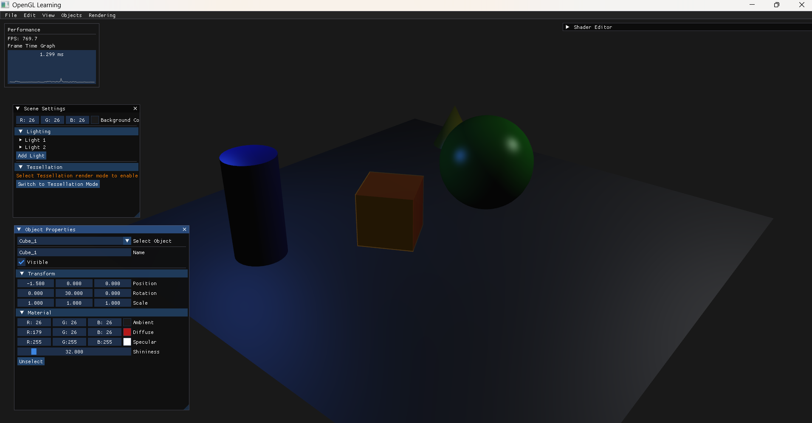
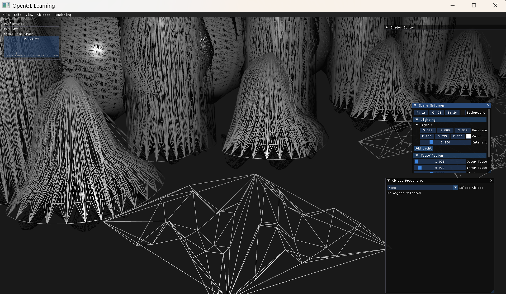
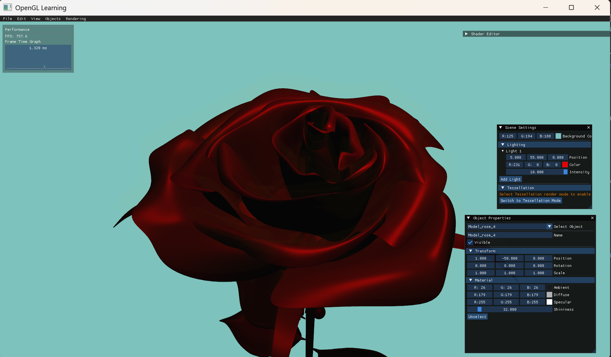

# OpenGL Learning Application

An interactive educational desktop application for Windows that allows users to learn and experiment with modern 3D graphics rendering techniques using OpenGL. The application demonstrates key stages of the rendering pipeline: geometry processing, tessellation, shaders, lighting, and object transformations.



## Features

- **Interactive 3D Scene**: Add, remove, and manipulate 3D objects in real-time
- **Basic 3D Shapes**: Includes cube, sphere, plane, cylinder, and cone primitives
- **Transform Controls**: Modify object transformations (translation, rotation, scaling)
- **Real-time Shader Editing**: Edit and compile GLSL shaders on the fly
- **Multiple Lighting Models**: Switch between Phong and Flat shading
- **Material Properties**: Adjust ambient, diffuse, and specular properties
- **Advanced Rendering Techniques**:
  - **Tessellation**: Dynamic subdivision and displacement of geometry for increased detail
  - **Deferred Rendering**: Separate geometry and lighting passes for improved performance
  - **Wireframe Mode**: Visualize the triangle mesh structure
- **Scene Saving/Loading**: Save and load scene configurations to/from JSON files
- **Camera Controls**: Navigate the 3D scene using keyboard and mouse
- **Model Loading**: Import and render complex 3D models using Assimp library

## Development Progress

| Feature                   | Status      | Notes                                                      |
|---------------------------|-------------|-----------------------------------------------------------|
| 3D Scene Rendering        | ✅ Complete | Full rendering pipeline with multiple modes                |
| Camera Navigation         | ✅ Complete | WASD + mouse controls with view/projection matrices        |
| Basic 3D Shapes           | ✅ Complete | All primitive shapes implemented and working               |
| Light Effects             | ✅ Complete | Multiple light sources with Phong lighting model           |
| UI Panels & Controls      | ✅ Complete | Complete ImGui integration with all control panels         |
| Object Transformations    | ✅ Complete | Full transform control with position, rotation, scale      |
| Material Editing          | ✅ Complete | Material property editing with real-time updates           |
| Shader Editor             | ✅ Complete | Runtime shader compilation and parameter adjustment        |
| Scene Save/Load           | ✅ Complete | Full scene serialization with JSON                         |
| Model Loading             | ✅ Complete | Assimp integration for complex model loading               |
| Tessellation              | ✅ Complete | Hardware tessellation for both meshes and models           |
| Deferred Rendering        | ✅ Complete | G-buffer generation and lighting pass implementation       |
| Object Highlighting       | ✅ Complete | Interactive object selection with visual feedback          |



## Prerequisites

- Windows 10/11
- Visual Studio 2019 or newer
- CMake 3.15 or newer
- [vcpkg](https://github.com/microsoft/vcpkg) package manager
- Graphics card with OpenGL 4.0+ support for tessellation features

## Dependencies

- OpenGL 4.0+ (for tessellation shader support)
- GLFW (window/context management)
- glad (OpenGL loader)
- GLM (3D math library)
- ImGui (UI library)
- Assimp (3D model loading)
- nlohmann-json (JSON serialization)

## Build Instructions

### 1. Install vcpkg

If you don't have vcpkg installed:

```powershell
git clone https://github.com/Microsoft/vcpkg.git
cd vcpkg
.\bootstrap-vcpkg.bat
.\vcpkg integrate install
```

### 2. Clone the Repository

```powershell
git clone https://github.com/luluu9/OpenGLLearning.git
cd OpenGLLearning
```

### 3. Build with CMake

```powershell
mkdir build
cd build
cmake .. -DCMAKE_TOOLCHAIN_FILE=[path-to-vcpkg]/scripts/buildsystems/vcpkg.cmake
cmake --build . --config Release
```
or with presets:
Set your path to vcpkg in `CMakeUserPresets.json`
```json
"environment": {
    "VCPKG_ROOT": "[path-to-vcpkg]"
}
```
```bash
cmake --preset=default build
cmake --build build
```

Replace `[path-to-vcpkg]` with the actual path to your vcpkg installation.

### 4. Run the Application

```powershell
cd Release
.\OpenGLLearning.exe
```

## Running clang-tidy
To use clang-tidy, you have to generate compilation database. At the time of writing it is possible only with Makefile and Ninja generator (CMAKE_EXPORT_COMPILE_COMMANDS=1), so use build-ninja preset:
```bash
cmake --preset=build-ninja
```
Then, run clang-tidy, providing compilation database, e.g:
```bash
clang-tidy -checks="*" -warnings-as-errors=* -p .\build-ninja\ .\src\Application.cpp
```
You can also use provided Powershell script to run linter on all project files:
```bash
.\scripts\Run-ClangTidy.ps1
```

## Usage

### Camera Navigation

- **W/A/S/D**: Move camera forward/left/backward/right
- **Space/Ctrl**: Move camera up/down
- **Right Mouse Button + Mouse Move**: Rotate camera

### User Interface

- **Object Properties**: Select and modify 3D object properties
- **Scene Settings**: Adjust lighting and background color
- **Shader Editor**: Edit and compile GLSL shaders in real-time
- **Performance Overlay**: Monitor FPS and frame time

### Main Menu
- **File**: Create, open, and save scenes
- **Edit**: Access shader editor
- **View**: Toggle interface panels
- **Objects**: Add primitive shapes and import models
- **Rendering**: Change rendering mode and lighting model
- **Tessellation**: Control tessellation parameters and displacement

## Rendering Features

### Standard Rendering
Default rendering pipeline with Phong lighting model and standard triangle primitives.

### Tessellation
Dynamic subdivision of geometry using hardware tessellation:
- Control outer and inner tessellation levels
- Apply displacement for surface detail
- Compatible with both simple meshes and complex models

### Deferred Rendering
Two-pass rendering technique for improved lighting performance:
- G-buffer generation (position, normal, albedo, specular)
- Separate lighting pass with multiple light sources

## Project Structure

- **include/**: Header files
- **src/**: Implementation files
- **resources/**: 
  - **shaders/**: GLSL shader files
  - **scenes/**: Saved scene configurations
  - **models/**: 3D model files



## Troubleshooting

### Build issues
- Error message like this when executing `cmake`:
  ```bash
  CMake Error at CMakeLists.txt:2 (project):
    Running
    'nmake' '-?'
    failed with:
    no such file or directory
  ```
  **Solution**: use Developer PowerShell for VS in the building process

- Could not find a package:
  ```bash
  Could not find a configuration file for package "glfw3" that is compatible
  with requested version "".
  ```
  **Solution**: Delete and reconfigure the build directory
  ```bash
  rm build/*
  mkdir build
  cd build
  cmake .. -DCMAKE_TOOLCHAIN_FILE=[path_to_vcpkg.cmake]
  cmake --build . --config Release
  ```


### ImGui UI Not Displaying
If the ImGui UI elements aren't visible despite successful initialization:
1. Ensure you're using the official ImGui implementation files from the [ImGui repository](https://github.com/ocornut/imgui)
2. Check that both backends are properly initialized (ImGui_ImplGlfw_InitForOpenGL and ImGui_ImplOpenGL3_Init)
3. Verify that the OpenGL state is properly managed between your 3D rendering and ImGui rendering
4. Delete imgui.ini if it exists to allow ImGui to create a fresh configuration

### OpenGL Errors
If you encounter OpenGL-related errors:
1. Enable debug output using glEnable(GL_DEBUG_OUTPUT)
2. Check for OpenGL version compatibility
3. Ensure all shader compilation and linking is successful

### Tessellation Issues
If you encounter problems with tessellation:
1. Verify your GPU supports OpenGL 4.0+ with hardware tessellation
2. Ensure all tessellation shaders (.tesc and .tese) are compiling without errors
3. Verify uniform values for tessellation levels are being passed correctly

## License

This project is licensed under the MIT License - see the LICENSE file for details.

## Acknowledgments

- OpenGL SuperBible
- Learn OpenGL by Joey de Vries
- GL Mathematics (GLM)
- Dear ImGui
